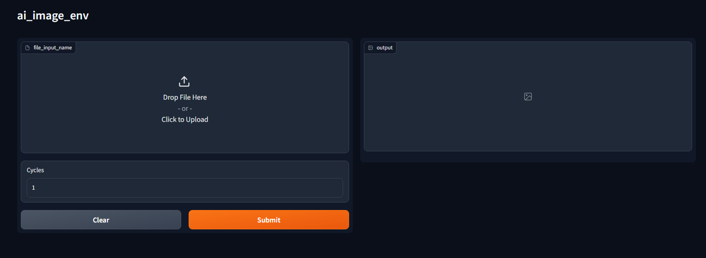

# ai_image_env

A browser interface based on Gradio library for Stable Diffusion, input from .env files for an easy image creation.


# Installation:

1. Install [Python 3.10.6](https://www.python.org/downloads/release/python-3106/), checking "Add Python to PATH".
2. Install [git](https://git-scm.com/download/win).
3. On terminal:
```bash
git clone https://github.com/shiroppo/ai_image_env
cd ai_image_env
py -m venv venv
.\venv\Scripts\activate
pip install -r requirements.txt
```
- and then:
```bash
pip install torch==2.0.1+cu118 torchvision==0.15.2+cu118 torchaudio==2.0.2 --index-url https://download.pytorch.org/whl/cu118
```
# Run
- click on app_gradio.bat
- the interface is now open on the default browser, than select the .env/.yaml file that you prefer(in ./env/ directory)
- select the cycles(how many images you want)
- click "Submit"
- you can find the output in the ./image/_today_date_/ directory
---
- Download from hugginface or any similar website every checkpoint that you use and put them into ./models/Stable-diffusion/ if they are stable diffusion xl models or ./models/Stable-diffusion/1.5/ if they are stable diffusion 1.5/2.0/2.1 models
- Download from hugginface or any similar website every LoRA that you use and put them into ./models/Lora if they are stable diffusion xl LoRA or ./models/Lora/1.5/ if they are stable diffusion 1.5/2.0/2.1 LoRA
- Download from hugginface or any similar website every VAE that you use and put them into ./models/VAE/
- Download from hugginface or any similar website every negative embeddings that you use and put them into ./embeddings/
---
# Compel
In the prompt/negative prompt you can use the "prompt weighting":
```bash
- Example: "a grey cat++ playing with a ball----"
```
- in this example the cat(+) is MORE important that the ball(-)

# Files input compatibility:
- .env
- .yaml
- .png(created with ai_image_env)

# Versions
- v1.0: First Version
- v1.1: Added "Prompt" textbox, if empty the prompt is obtained from the selected *.env file

# Support:
- ko-fi: (https://ko-fi.com/shiroppo)
